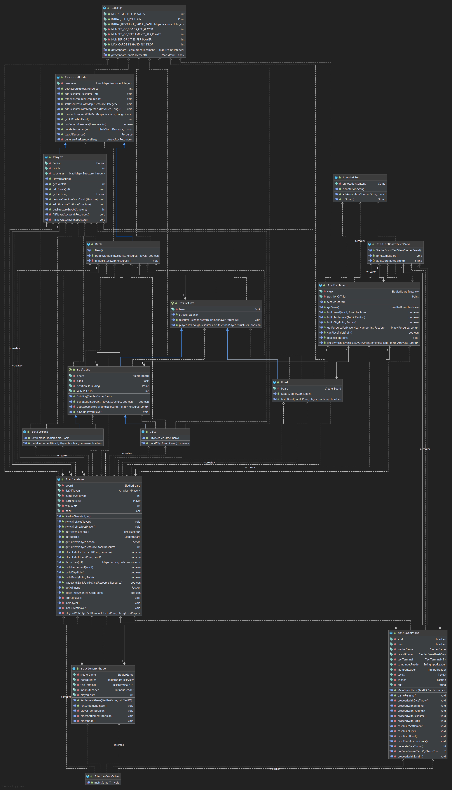

# Group 13 Itsafeature Catan

## Basic introduction
This is project 3 of the module PM1. 

The game basically consists of three phases.

 1. You enter the number of players and the required number of points one player must have to win. There have to be at least two players and you need a minimum of three win points.
 2. Now you enter the settlement phase. Each player can set roads and settlements according to the rulebook of Catan.
 3. After these two initial phases you are in the main game. Here you can trade with the bank or place settlements, roads or cities. Beware of the thief though. He's out to get you.
 
### Rulebook
You may find the rulebook here (PDF, EN): [Catan Rulebook](https://www.catan.com/files/downloads/catan_base_rules_2020_200707.pdf)
 
### Additional notes
 - This game has been stripped of some functionality compared to the full fledged version. These changes are according to the requirements of PM1.
 - Most of the steps and functions are self-explanatory after you've read the rulebook. To find the right coordinates you may use the numbers on the X- and Y-axis around the printed board.

### The map
``` 
   0        1        2        3        4        5        6        7        8        9        10       11       12       13       14       
0                                     (  )              (  )              (  )              (  )                                                  
                                    //    \\          //    \\          //    \\          //    \\                                          
                                 //          \\    //          \\    //          \\    //          \\                                       
1                            (  )              (  )              (  )              (  )              (  )                                
                              ||       ~~       ||       ~~       ||       ~~       ||       ~~       ||                                 
                              ||                ||                ||                ||                ||                                 
3                            (  )              (  )              (  )              (  )              (  )                                
                           //    \\          //    \\          //    \\          //    \\          //    \\                                 
                        //          \\    //          \\    //          \\    //          \\    //          \\                              
4                   (  )              (  )              (  )              (  )              (  )              (  )                                
                     ||       ~~       ||       WD       ||       WL       ||       WL       ||       ~~       ||                                 
                     ||                ||        6       ||        3       ||        8       ||                ||                                 
6                   (  )              (  )              (  )              (  )              (  )              (  )                                
                  //    \\          //    \\          //    \\          //    \\          //    \\          //    \\                        
               //          \\    //          \\    //          \\    //          \\    //          \\    //          \\                     
7          (  )              (  )              (  )              (  )              (  )              (  )              (  )              
            ||       ~~       ||       GR       ||       ST       ||       GR       ||       WD       ||       ~~       ||               
            ||                ||        2       ||        4       ||        5       ||       10       ||                ||               
9          (  )              (  )              (  )              (  )              (  )              (  )              (  )              
         //    \\          //    \\          //    \\          //    \\          //    \\          //    \\          //    \\               
      //          \\    //          \\    //          \\    //          \\    //          \\    //          \\    //          \\            
10(  )              (  )              (  )              (  )              (  )              (  )              (  )              (  )              
   ||       ~~       ||       WD       ||       CL       ||       --       ||       ST       ||       GR       ||       ~~       ||               
   ||                ||        5       ||        9       ||        7       ||        6       ||        9       ||                ||               
12(  )              (  )              (  )              (  )              (  )              (  )              (  )              (  )              
      \\          //    \\          //    \\          //    \\     T    //    \\          //    \\          //    \\          //            
         \\    //          \\    //          \\    //          \\  T //          \\    //          \\    //          \\    //               
13         (  )              (  )              (  )              (  )              (  )              (  )              (  )              
            ||       ~~       ||       GR       ||       ST       ||       WD       ||       WL       ||       ~~       ||               
            ||                ||       10       ||       11       ||        3       ||       12       ||                ||               
15         (  )              (  )              (  )              (  )              (  )              (  )              (  )              
               \\          //    \\          //    \\          //    \\          //    \\          //    \\          //                     
                  \\    //          \\    //          \\    //          \\    //          \\    //          \\    //                        
16                  (  )              (  )              (  )              (  )              (  )              (  )                                
                     ||       ~~       ||       WL       ||       CL       ||       CL       ||       ~~       ||                                 
                     ||                ||        8       ||        4       ||       11       ||                ||                                 
18                  (  )              (  )              (  )              (  )              (  )              (  )                                
                        \\          //    \\          //    \\          //    \\          //    \\          //                              
                           \\    //          \\    //          \\    //          \\    //          \\    //                                 
19                           (  )              (  )              (  )              (  )              (  )                                
                              ||       ~~       ||       ~~       ||       ~~       ||       ~~       ||                                 
                              ||                ||                ||                ||                ||                                 
21                           (  )              (  )              (  )              (  )              (  )                                
                                 \\          //    \\          //    \\          //    \\          //                                       
                                    \\    //          \\    //          \\    //          \\    //                                          
22                                    (  )              (  )              (  )              (  )                                                  
```

### A single tile
Since this is a bit hard to read, here is a little explanation of a field.

#### Land
A Land field consists mainly of two values. One is the type of land you have, the other is the number you have to roll with the dice to receive this resource.
Below the field you'll find a legend of the resource types.
```
         (  )                                              
       //    \\                         
    //          \\         
(  )              (  )             
 ||       WL       ||   
 ||       8        ||              
(  )              (  )               
    \\          //                     
       \\    //                     
         (  )    
```
##### Resource types
- WL = Wool
- WD = Wood
- ST = Stone
- CL = Clay
- GR = Grain
- -- = Desert, this field never pays out any resources. Be cautious, the thief lives here.

#### Land with structure
When you build a structure on a land field, it gets represented through text as well.
You'll see the shorthand of your faction (e.g "rr" represents the faction RED)
##### Settlement
Settlements can be placed on all coordinates that meet the parentheses
```
         (  )                                              
       //    \\                         
    //          \\         
(  )              (rr)             
 ||       WL       ||   
 ||       8        ||              
(  )              (  )               
    \\          //                     
       \\    //                     
         (  )    
```
##### Road
Roads always have to attach to a settlement. They start at a parenthesis and end at another one.
They get represented the same way as a settlement but in between the vertical bars (pipe symbols).
```
         (  )                                              
       //    \rr\                         
    //         \rr\         
(  )              (rr)             
 ||       WL       ||   
 ||       8        ||              
(  )              (  )               
    \\          //                     
       \\    //                     
         (  )    
```
#### Water
A field that only contains two tildes (\~~) consists of water. You cannot build anything here.

The thief cannot go here either.
```
         (  )                                              
       //    \\                         
    //          \\         
(  )              (  )             
 ||       ~~       ||   
 ||                ||              
(  )              (  )               
    \\          //                     
       \\    //                     
         (  )    
```

#### Thief
The thief is represented by two capital T on top of each other.

At the start of the game the thief is in the desert (the field in the middle).
He can be placed anywhere except water. 
More details on how to deal with the thief can be found in the Rulebook.

```
         (  )                                              
       //    \\                         
    //          \\         
(  )              (  )             
 ||       --       ||   
 ||                ||              
(  )              (  )               
    \\     T    //                     
       \\  T //                     
         (  )    
```

## Information for developers

\<warning> this section is not needed to play the game. Only proceed if you know what you do \</warning> 

### Class Diagram



(You'll also find this diagram in doc/class_diagram.png)

### Test results

[Link to Test results](https://github.zhaw.ch/PM1-IT20taWIN-berp-bles-kars/gruppe13-itsafeature-projekt3-catan/blob/master/doc/Test%20Results%20-%20SiedlerGameTest.html)

To see the test results in a more comfortable view, you have to download the file and open it with your browser.

(Path: doc/Test Results - SiedlerGameTest.html)

### Test documentation

[Link to Test documentation](https://github.zhaw.ch/PM1-IT20taWIN-berp-bles-kars/gruppe13-itsafeature-projekt3-catan/blob/master/doc/SiedlerGameTest_Documentation.md)

(Path: doc/SiedlerGameTest_Documentation.md)

