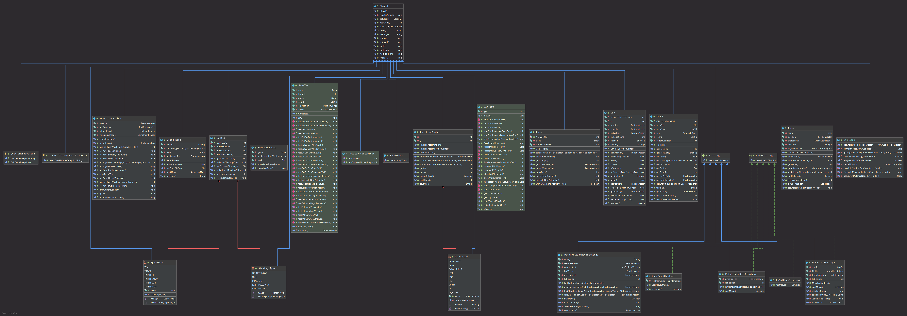

# Team 2 Itsafeature Racetrack

## How to start the game
1. Clone the source code to a directory of your choice.
1. `cd` into that directory
1. run the command `gradle run`

## How to play the game
### Set up phase
At the start of the game you will be asked a few questions. They are in order:

#### Choose your track
The first question is about the track you want to use. It displays all files within the `tracks/` directory.
Type in the number corresponding to your desired track and press enter.

Each track has a fixed number of cars and in turn a fixed number of players. 
This means if you play with 3 friends you have to choose a track that contains 4 cars (or two players play as navigators and hop in the same car as the drivers).

If you want to know how to make your own tracks please refer to the section "Creating your own tracks"

#### Choose your strategy
After you've decided which track you want to drive on, each driver will be asked to input the strategy they want to drive.
The strategies are as follows:
 1. DO_NOT_MOVE: In this strategy your car simply stays in place and you will never move. This is recommended for people who are especially defensive drivers.
 1. USER: With this strategy you get to decide the acceleration and direction of your car yourself. You'll see how to do this in the MainGamePhase Section of this handbook.
 1. MOVE_LIST: If you want to prepare your moves beforehand you can add them to a list and put the list into the `moves/` directory. You are then able to choose your moves in the next step. Afterwards your car will exactly drive your moves step-by-step.
 1. PATH_FOLLOWER: Are you a person who prefers a bit more of a hands-off variant while still being in control? Then you can add a file with waypoints to the `follower/` directory. The car will then calculate the correct moves automatically. Please refer to the corresponding section if you want to know how to write those waypoints.
 1. PATH_FINDER: This is for everyone who is too busy to play games but still wants to have a good time with his friends. The car will drive completely autonomous. Maybe a bit too futuristic for some.

### Main Game
Now it's all about racing. If you've chosen another strategy than USER or MOVE_LIST, this section is most certainly of no interest to you since your car will either move by itself or not at all.

For the two strategies mentioned you will need this grid:

```
____________________________________
|           |          |            |
|  UP_LEFT  |    UP    |  UP_RIGHT  |
|    7      |    8     |     9      |
|___________|__________|____________|
|           |          |            |
|   LEFT    |   NONE   |   RIGHT    |
|    4      |    5     |     6      |
|___________|__________|____________|
|           |          |            |
| DOWN_LEFT |   DOWN   | DOWN_RIGHT |
|     1     |    2     |     3      |
|___________|__________|____________|
```

It defines the different decisions you can take.
As an example:
Let's say your car is currently in a standstill at the start position.

If you now choose `NONE` you will stay at your position and not move at all. To start driving you have to choose a direction such as `RIGHT`.

Now remember, and this is important:
**These directions are as seen by the player on the screen. _NOT_ from the perspective of the car**

We assume you chose `RIGHT` from your start. Your car will now start to move

Pro Tip: Instead of typing out these long direction names, you can simply input the numbers corresponding to the directions in the grid.
```
Start position:
>
>
> a
>
>
```
```
You've chosen to drive to the RIGHT:
>
>
> ------> a //your new position
>
>
```
If you now want to drive with your current speed and direction, you can choose `NONE` at your next turn. 

If you choose `RIGHT` again **your car will accelerate again.**
To slow down you have to choose `LEFT`.

```
What happens if you choose RIGHT again:
>
>
>          ------------> a
>
>
```
To turn you either have to choose `UP` or `DOWN` (`UP_` or `DOWN_` to accelerate and decelerate respectively).
Note: _this changes with the current direction your car is driving towards._ 

This means you always have to keep in mind how your car was driving at your last turn to predict how it will behave after your entry.

After each turn you will be asked to enter `c` to continue or `q` to quit.

## How to create your own content
### Tracks
Creating tracks is really simple. You just add a *.txt file with your track in ASCII to the `tracks/` folder and you're immediately able to play it.
There are a few things to look out for:

`#` are walls. They make up the boundaries of your track.

`>` Those signs mark the finishing line. The cars have to start in a manner to be able to drive over it in the direction of the arrow.

`whitespace` (this means literal whitespace) is your track. You will be able to drive on here.

All other characters will get interpreted as cars.

Examples:

This track is valid:
```
##########################
# a                  >  ##
#                    >  ##
# b                  >  ##
##########################
```
This one is not:
```
##########################
# a                  <  ##
#                    <  ##
# b                  <  ##
##########################
```
### Moves
These are needed if you want to make use of the MOVE_LIST Strategy.

You simply create a list of moves according to the grid above and your car will drive them from the top down.

Example:

Valid:
```
RIGHT
RIGHT
RIGHT
NONE
NONE
NONE
NONE
```

Invalid:
```
RIGHT, RIGHT, RIGHT, NONE, NONE, NONE, NONE
```

### Waypoints
Waypoints have to be saved into the `follower/` direction.
The files have to contain a list of X and Y Coordinates to mark the place on the track.
The X coordinates start from the left and the Y coordinates from the top.
Each value starts with a 1.

Example:
The `O` in the track marks the waypoint (only for demonstration purposes):
Here the value of the coordinates are `12` for the X coordinate and `2` for the Y coordinate (remember, from the top) 
```
##########################
# a        O         >  ##
#                    >  ##
# b                  >  ##
##########################
```
You have to write them into the list in the following manner:
`(X:12, Y:2)`

A valid list would be:
```
(X:31, Y:22)
(X:34, Y:22)
(X:37, Y:22)
(X:40, Y:22)
(X:43, Y:22)
```

This is an invalid list:
```
(Y:22, X:31)
(Y:22, X:34)
(Y:22, X:37)
(Y:22, X:40)
(Y:22, X:43)
```

## Information for developers

\<warning> this section is not needed to play the game. Only proceed if you know what you do \</warning>

### General information

The project is largely maintained through issues and pull requests. If you find a problem with the game please open up a new issue.
If you are able to fix it yourself and like to contribute, feel free to open a pull request.
#### Git Branching
Since this program was build largely from the ground up it was decided to use a branching model where each contributor has his own branch and pushes his changes in there.
For the first phase where we wanted to get the game up and running we quite often merged them into master so everybody was able to run the game locally.
Later only after features have been completed have they been merged into master.


### Git structure
#### Folders
##### follower
This folder contains files with waypoints as explained above.

##### gradle/wrapper
The gradle *.jar resides here. Do not change this.

##### moves
Here are the moves as described in the section about moves above.

##### src
This folder contains many subfolders with source code. 
###### src/main/resources
Additional resources would be saved here. For now it only contains the properties for the output terminal.
###### src/main/java/ch/zhaw/pm2/racetrack/
This folder contains all the source code which does not come from an external source.

###### src/main/java/ch/zhaw/pm2/racetrack/strategy
The files in here implement the moveStrategy Interface.

###### src/test/java/ch/zhaw/pm2/racetrack/
All build tests will be saved in here. 
Test Documentation can be found in the folder [`doc/TestDocumentation`](https://github.zhaw.ch/PM2-IT20taWIN-bles-mach-kars/hk2-team2-itsafeature-project1-racetrack/tree/master/doc/TestDocumentation)

### How to start the tests
Clone the code onto your machine the same way you would to start it, `cd` into it also the same way and then run `gradle test`.
### Test results
For best viewing experience, clone the files to your computer first.

The test results can be found in the following directory:
[`reports/tests/test`](https://github.zhaw.ch/PM2-IT20taWIN-bles-mach-kars/hk2-team2-itsafeature-project1-racetrack)

Open the `index.html` to view the results in your browser.

### Class Diagram



You'll also find this diagram under [`doc/class_diagram.png`](https://github.zhaw.ch/PM2-IT20taWIN-bles-mach-kars/hk2-team2-itsafeature-project1-racetrack/blob/master/doc/class_diagram.png)
