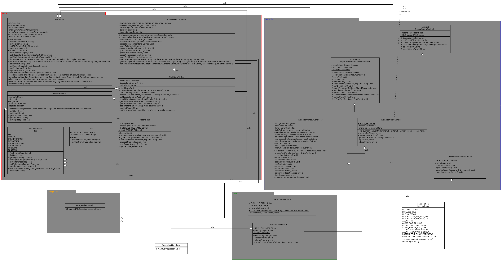

Architecture Documentation
---------------
Since this project is quite complex, and we've only got a small amount of time for development, our choice was to prioritize on the most important and trivial features. Our app has a GUI, which abides to the MVC pattern. This required our app to be structured concisely. So, we came up with this class diagram:

Since this class diagram is a little bit overwhelming at first, we actually recommend opening it in UMLetino.
To do that, download the [Classdiagram uxf file](classdiagram.uxf) and import it into [UMLetino](https://www.umletino.com/umletino.html) where you can zoom in and scroll around easier.

Our app has two windows: the first one being the welcome window, and the second one being the text editor. This required us to have two controllers that can communicate with each other. As a solution to that, we decided to create a super class controller.
The project is structured in the following way:
- The controller directory contains the controllers for the two windows as well as the super class controller
- The model folder contains code that has nothing to do with the UI, such as the MarkDown interpreter as well as other logic.
- The view folder contains the view for the two windows. 

The core of this project consists of these classes:
- The markdown interpreter class reads Markdown text from a file and applies the styling to the document so that it's correctly displayed to the user.
- The markdown writer class does the opposite of what the markdown interpreter does, that is, it reads and analyses the styled document and generates a Markdown document from it, which can be saved to a file.
- The document class is responsible for handling the reading and writing to a file.
- The ParsedContent class holds the position and formatting of each bit of text in it. This gives us a lot of flexibility regarding the displaying of the content as the data itself doesn't have to be recalculated to be displayed in other GUI frameworks or to be saved into other formats (e.g PDF). We can simply take the existing data and apply it to our needs.

This project structure allows us to work in an organized manner, and ensures that the codebase is scalable as well as future-proof.
It also enables us to decouple most of the functionality from one another. So if we at one point decide to include other features (such as additional storage backends) it won't impact our previous work. In fact, the rest of the code will remain completely functional no matter what backends we would include.
